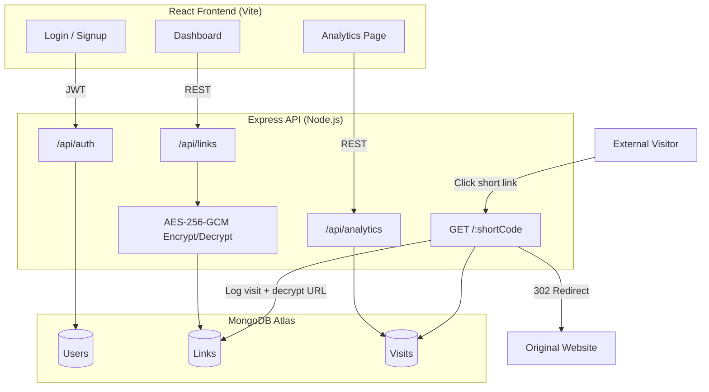
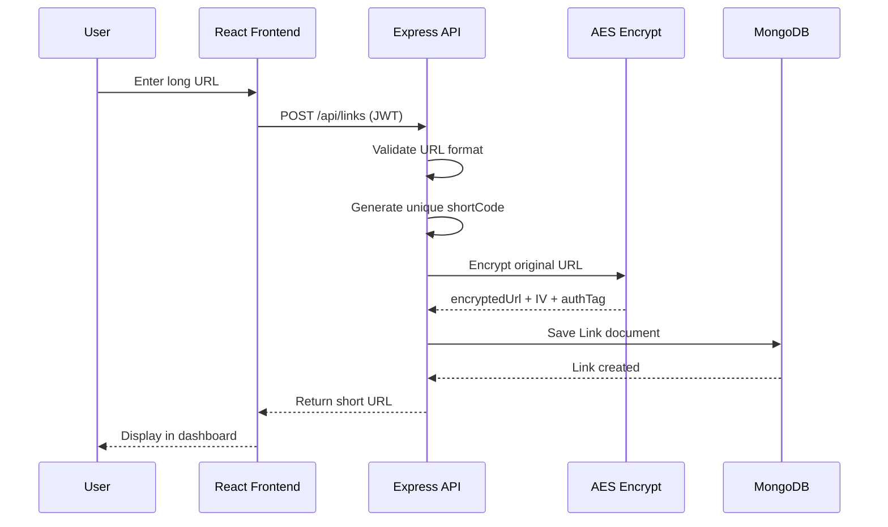
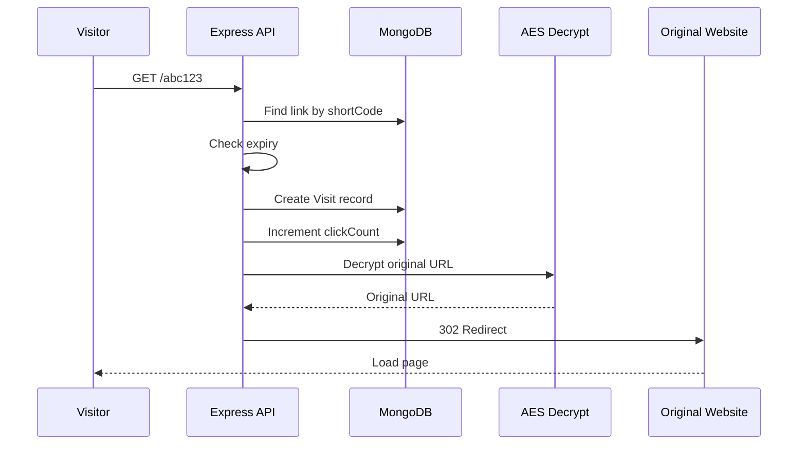

# Architecture — URL Shortener

## System Overview



## Data Flow: Create Link



## Data Flow: Redirect & Analytics



## Database Schema

### Users Collection
```
{
  _id: ObjectId,
  name: String,
  email: String (unique),
  passwordHash: String,
  createdAt: Date,
  updatedAt: Date
}
```

### Links Collection
```
{
  _id: ObjectId,
  userId: ObjectId (ref: Users),
  shortCode: String (unique, indexed),
  encryptedUrl: String,
  urlIv: String,
  urlAuthTag: String,
  customAlias: String | null,
  expiresAt: Date | null,
  isActive: Boolean,
  clickCount: Number,
  createdAt: Date,
  updatedAt: Date
}
```

### Visits Collection
```
{
  _id: ObjectId,
  linkId: ObjectId (ref: Links, indexed),
  visitedAt: Date (indexed),
  ip: String,
  userAgent: String,
  device: String,
  browser: String,
  os: String
}
```

## Security Architecture

| Layer | Mechanism |
|-------|-----------|
| Passwords | bcrypt (12 salt rounds) |
| URLs at rest | AES-256-GCM encryption |
| API access | JWT Bearer tokens |
| Brute force | express-rate-limit |
| HTTP headers | Helmet.js |
| CORS | Restricted to frontend URL |
| Data isolation | userId filter on all queries |

## API Endpoints

| Method | Endpoint | Auth | Description |
|--------|----------|------|-------------|
| POST | /api/auth/signup | No | Register user |
| POST | /api/auth/login | No | Login, get JWT |
| GET | /api/auth/me | Yes | Current user |
| POST | /api/links | Yes | Create short link |
| GET | /api/links | Yes | List user's links |
| DELETE | /api/links/:id | Yes | Delete link |
| PATCH | /api/links/:id | Yes | Edit destination URL |
| GET | /api/links/:id/qr | Yes | Get QR code |
| GET | /api/analytics/:id | Yes | Link analytics |
| GET | /api/public/:shortCode/stats | No | Public click count |
| GET | /:shortCode | No | Redirect + log visit |
